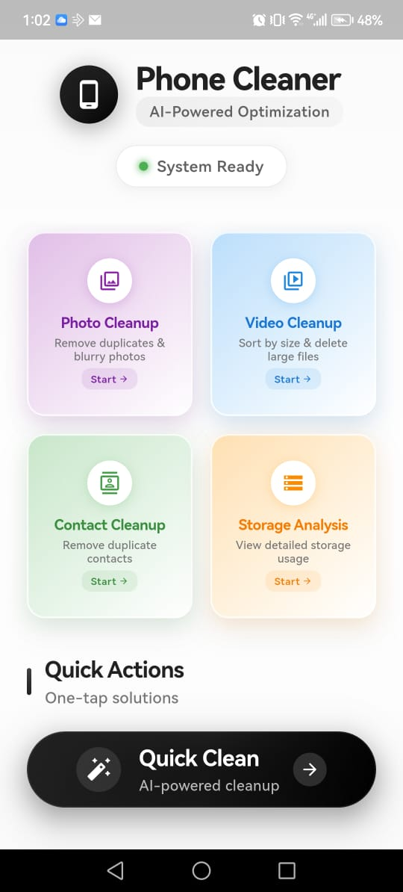
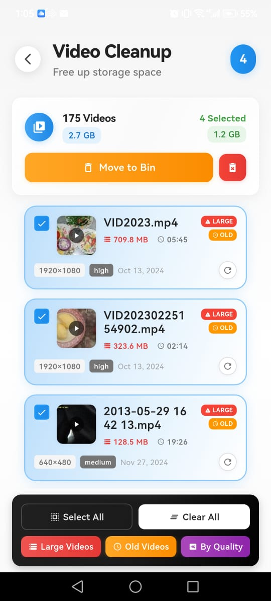
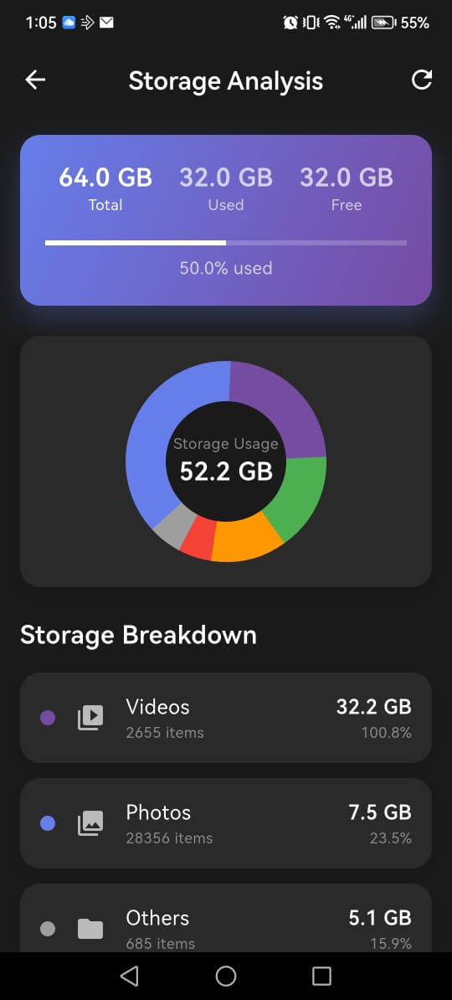

# CleanChamp

🧹 **AI Storage Cleaner App**

Smart, AI-powered mobile app to clean and optimize device storage by detecting:

- Blurred media  
- Duplicate files  
- Unused photos/videos  
- Unnecessary documents  
- Unused contacts  

100% **on-device AI processing** for safe and private cleanup.

---

## 📱 App Overview

Modern smartphones accumulate thousands of files.  
CleanChamp uses **AI + heuristics** to analyze storage and provide **safe, user-controlled cleanup suggestions**.

**Goals:**

- Free up device storage  
- Improve device performance  
- Safe, user-approved deletion  
- Minimal, intuitive UX  

---

## 🖼️ Screenshots

_All screenshots stored in `assets/screenshots/`_

  
  
  

## 🏗️ Architecture Diagram

  

---

## ✨ Core Features

- **AI Media Cleaner:** Blur & low-quality detection, similar image grouping, best-photo recommendation  
- **Duplicate Finder:** Photos, videos, documents; hash & perceptual similarity; smart auto-selection  
- **Old & Unused Files:** Long-unused media, large file prioritization, usage-based recommendations  
- **Document Cleaner:** PDFs, ZIPs, APKs & misc files; highlights large/unused files  
- **Contact Cleaner:** Duplicate contacts, empty/incomplete contacts, safe merge suggestions  
- **AI Enhancer:** Smart cleanup suggestions, quality-aware decisions, category-wise insights  

---

## 🏗️ Architecture (Clean & Functional)

lib/
├── core/ # utils, permissions, constants, theme
├── data/ # models, datasources, repositories_impl
├── domain/ # entities, repositories, usecases
├── features/ # media, duplicates, documents, contacts, dashboard
└── main.dart

**Functional Flow:**

1. **Scan Storage** → media, documents, contacts  
2. **AI Analysis** → blur, quality, similarity  
3. **Rule Processing** → usage, size, age  
4. **User Review** → preview & select  
5. **Safe Cleanup** → confirm & delete  

---

## 🧰 Tech Stack

- **Framework:** Flutter (Cross-platform mobile)  
- **AI & Intelligence:** TensorFlow Lite, image heuristics (blur, sharpness, noise), perceptual similarity, offline processing  
- **State & Architecture:** Provider, GetIt (DI)  
- **Storage & Media:** photo_manager, path_provider, external_path, storage_space, disk_space_plus  
- **Media Processing:** image, video_thumbnail, video_player  
- **Contacts:** contacts_service_plus  
- **Permissions & Device:** permission_handler, device_info_plus  
- **Local Storage:** shared_preferences  
- **UI & Utilities:** intl, cupertino_icons  

---

## 🔐 Permissions Used

- Storage (read/write)  
- Media (photos & videos)  
- Contacts (optional for contact cleaner)  

> Permissions used strictly for core functionality.

---

## 🚀 Performance

- Background scanning (isolates)  
- Lazy thumbnail loading  
- Optimized AI inference for low-end devices  

---

## 🔒 Privacy First

- 100% on-device processing  
- No cloud uploads (future updates)  
- No personal data tracking  

---

## 📌 Roadmap

- Advanced TensorFlow Lite models  
- Auto-clean scheduler  
- Cloud backup suggestions  
- iOS optimization  

---

## 🤝 Contributing

Contributions welcome!  
Fork and submit pull requests.

---

## 📄 License

MIT License

---

## 🙌 Acknowledgements

Built with ❤️ using Flutter + AI intelligence for effortless storage management.

**Feature-Based Clean Architecture**

